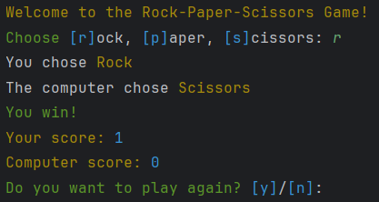

# **RockPaperScissorsBySimeon**
**Python project for Rock–Paper–Scissors game**

**Overview**
Rock, Paper, Scissors is a simple hand game usually played between two people. Each player simultaneously forms one of three shapes with an outstretched hand.  
The possible shapes are:  
- _Rock_ (a fist)  
- _Paper_ (an open hand)  
- _Scissors_ (a fist with the index and middle fingers extended, forming a V)

**Rules**  
The rules of the game are straightforward:

_Rock_ crushes _Scissors_.  
_Scissors_ cuts _Paper_.  
_Paper_ covers _Rock_.  
If both players choose the same shape, the game is a **draw**.

**Game Flow**  
1. Start the Game: The game can be started a player deciding to play.  
2. Player Input: Player chooses one of the three shapes (Rock, Paper, or Scissors).
3. Computer Input: Computer randomly chooses one of the three shapes.
4. Compare Choices: The game compares the choices made by the player and the computer.
5. Determine Winner: The game applies the rules to determine the winner or if it's a draw.
6. Display Result: The result is displayed, showing whether the game was a win, loss, or draw.
7. Play Again: Optionally, the player can choose to play again or end the game.

  
[**Source Code**](rock_paper_scissors.py)
